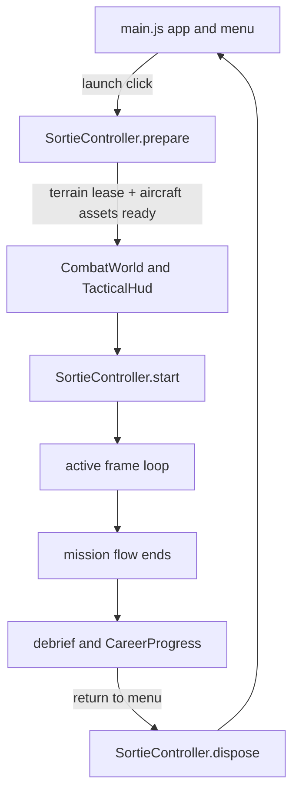

# Current architecture

## Source layout

```text
src/
  main.js                 app entry and lifecycle coordinator
  assets/                 runtime asset loading and disposal
  aircraft/               player and hostile aircraft visuals
  audio/                  game audio
  combat/                 sortie composition and combat systems
  config/                 mission and difficulty configuration validation
  effects/                flight particles, trails, and combat effects
  environment/             terrain, atmosphere, clouds, and sun
    terrain/              terrain coverage and moving detail streamer
  game/                   mission preparation and active sortie lifecycle
  ground/                 procedural ground vehicle visuals
  input/                  flight controls
  mission/                mission definitions and local progression
  performance/            development stress scenario and combat telemetry
  ui/                     HUD, menu radar, translations, and styles

tests/
  combat/                 combat-system tests
  assets/                 shared asset loading and ownership tests
  config/                 mission and difficulty validation tests
  environment/terrain/    coverage tests
  input/                  control tests
  integration/            full combat and app lifecycle tests
  mission/                progression tests
```

`main.js` creates the Three.js scene, renderer, page-level controls, menu, and application frame loop. `SortieController` owns the preparation and lifecycle of one active sortie. `CombatWorld` is the per-sortie combat composition root: it constructs the systems, wires their dependencies, coordinates their combat update order, and presents combat/debrief state. Combat systems own focused state and behavior; callbacks and shared references connect them without making the world a second owner of every system's state.

## Combat responsibilities

| Responsibility | Owner | Main dependencies/state |
| --- | --- | --- |
| Page bootstrap, menu, app-level scene/renderer and outer frame loop | `main.js` | DOM, Three.js, controls, assets, terrain, audio, UI |
| Combat frame orchestration, system connections, combat HUD/debrief | `CombatWorld` | Scene, player, terrain, combat systems, DOM presentation nodes |
| Mission preparation, pause/resume, and sortie resource cleanup | `SortieController` | Asset repository, terrain, combat world, controls, audio callbacks |
| Built-in mission and difficulty configuration validation | `validateGameConfig` | Schemas, mission and difficulty definitions; currently called by tests, not runtime |
| Shared asset loading and terrain ownership | `AssetRepository` | Aircraft loader, terrain loader, per caller terrain leases |
| Terrain package creation, coverage, detail streaming and disposal | `environment/terrain.js` and `environment/terrain/detail-streamer.js` | Terrain metadata, height/imagery data, caller lease |
| Aircraft model loading and fighter instance visuals | `loadCombatAircraft`, `createFighter`, `plane-models.js` | Shared imported model roots, instance-owned overlays/materials, hit zones |
| Procedural ground vehicle visuals | `ground/vehicles.js` | Per-unit geometry/materials and vehicle specifications |
| Score and sortie destruction statistics | `ScoreSystem` | Award rules and hit/kill counters |
| Aircraft and ground unit destruction consequences | `DestructionSystem` | Scene, visual disposal, score, combat effects, feedback, radio callback |
| Explosion and spark visuals, object pools, and effect updates | `CombatEffects` | Scene, player, `FlightFX` particle emitter, audio |
| Shared particles, contrails, missile trails, and vapor | `FlightFX` in `effects/fx.js` | Dynamic render buffers, aircraft and projectile state |
| Sound effects, engine audio, radio cues and music | `GameAudio` | Web Audio/HTML audio, app-level user-gesture unlock |
| Flight input and aircraft control | `FlightControls`, `CombatInput` | Player transform, camera, pointer/keyboard state |
| Air unit spawning, hostile/wingman behavior and ownership | `AirBattle` plus spawn, fighter, helicopter, wingman, and weapon helpers | Player, terrain, units, velocity, projectile/countermeasure callbacks |
| Ground force spawning, movement, weapons, air defense and ownership | `GroundBattle` plus spawn, unit, movement, weapon, and air-defense helpers | Player, terrain, units, velocity, projectile callbacks |
| Target selection and radar display data | `CombatRadar` | Player heading/position, hostile and friendly contacts |
| Weapon cadence, inventory, and launch conditions | `WeaponSystem` | Radar mode/lock, player, audio/FX, projectile insertion |
| Projectile movement, guidance, damage, and expiry | `ProjectileSystem` | Projectile queues, collision queries, decoys, destruction callbacks |
| Swept hit tests, aircraft/unit impacts, and operational boundary checks | `CollisionSystem` | Previous/current transforms, terrain coverage, collider lists |
| Flare and chaff inventory/cooldowns, decoy motion, radar-track disruption, and countermeasure cleanup | `CountermeasureSystem` | Player/hostile aircraft, projectile seeker state, scene/audio/FX |
| Objective progress and mission outcome | `MissionSystem` | Mission objective, remaining targets, destruction state, presentation nodes |
| Sortie phases, navigation and waypoint presentation | `MissionFlowSystem` | Player position, mission settings, presentation nodes |
| Phase and wingman radio reports | `RadioSystem` | Phase changes, wingman events, audio cue, radio DOM nodes |
| Projected target, gun lead, missile and route cues | `TacticalHud` in `ui/hud.js` | Controls, camera, combat/radar/mission state, DOM nodes |
| Local unlocks, difficulty selection and best records | `CareerProgress` in `mission/progression.js` | Built-in missions, browser local storage |

The outer active-frame order in `main.js` is flight controls and engine audio, `CombatWorld.update()`, stress-scenario work, player collision/boundary checks, terrain detail streaming, `FlightFX`, flight readouts and `TacticalHud`, then render. Paused sorties skip simulation. Inside `CombatWorld.update()`, input and radar contacts/lock are updated before weapon requests; air and ground AI then run, followed by countermeasures, projectiles/collision effects, radio, objective evaluation, mission flow, HUD, and combat feedback. Player collision is checked after that method by `main.js`. This ordering means weapons and seekers consume the current radar state, while mission/UI state observes the frame's combat results.



The same `SortieController` is reused after returning to the menu, but each launch constructs a new `CombatWorld` and `TacticalHud`. A failed or superseded preparation aborts its load subscriptions and releases any uninstalled terrain result.

## State ownership

- `AirBattle` owns hostile aircraft and wingmen; `GroundBattle` owns friendly and hostile ground units.
- `WeaponSystem` owns gun timing and weapon stores. `ProjectileSystem` owns projectile queues and lifecycle.
- `CountermeasureSystem` owns flare and chaff inventories, deployment cooldowns, flare decoys, and countermeasure effects. Flares can divert only infrared seekers; chaff can temporarily disrupt an existing hostile fighter track or active radar-missile guidance.
- `CollisionSystem` retains swept player-position history and performs terrain, boundary, vehicle, aircraft, and projectile collision queries.
- `MissionSystem` owns objective timing/progress and completion/failure outcome. `MissionFlowSystem` owns sortie phase and route state.
- `ScoreSystem` owns sortie score, kill totals, gun hits, and one-time objective awards. `CombatWorld` exposes read-only score statistics for the HUD and debrief.
- `CombatTelemetry` owns event counters for development-sortie missile launches, countermeasure use/effect, and player damage by source. Existing combat systems report events to it; it does not sample the frame loop.
- `DestructionSystem` applies the shared consequences for destroyed hostile aircraft and ground units. AirBattle continues to own wingman health and loss behavior.
- `CombatEffects` owns explosion and spark scene objects and their pools. `FlightFX` owns shared particles, contrails, missile trails, and related render buffers.
- `AssetRepository` shares in-flight asset loads. Each terrain caller owns a lease and releases it when that terrain is no longer installed or pending for that caller. The installed terrain is application/menu state and remains while sorties come and go.
- `CombatWorld` owns sampled player velocity and connections between systems and the renderer/HUD.
- Menu, page-level dialogs, and outer frame wiring live in `main.js`. `CombatWorld` still queries several HUD/debrief nodes from the DOM and passes node references to presentation systems; radar and some other combat-facing presentation code also talks to DOM nodes. UI separation through narrow callbacks/adapters is partial, so changes must preserve current markup bindings unless deliberately migrating them.
- `FlightControls`, `MenuRadar`, `GameAudio`, the asset repository, and some module-level event listeners/resources are app-lifetime objects. Several have no common application shutdown coordinator; `main.js` disposes the sortie, `FlightFX`, missile pool, and shared combat-effect resources on non-persisted `pagehide`, while the remaining globals rely on the page lifetime. This is an existing lifecycle boundary to consider before adding more app-level listeners or resources.

## Runtime lifecycle

At startup, `main.js` creates app-level scene, renderer, player, controls, audio, `FlightFX`, and `AssetRepository`, starts the menu/animation loop, and requests menu terrain and shared aircraft assets. Terrain selection cancels the previous menu subscription. The launch click requests pointer capture synchronously; the sortie starts only after both preparation and canvas lock confirmation succeed. During flight, P pauses through the app and releases pointer lock programmatically. Pressing P while paused requests pointer lock and resumes only after `pointerlockchange` confirms that the renderer canvas owns the pointer. Escape is left to the browser's default pointer-unlock behavior; losing pointer lock alone does not pause flight or show a message. `FlightControls` reacquires pointer lock on a mouse click in the flight canvas. A denied lock request during app resume leaves the sortie paused and shows a retry explanation in the pause dialog. `SortieController` owns sortie transitions and audio/input state, while `main.js` owns browser pointer-lock state and pause/resume input.

`MissionFlowSystem` advances from departure and ingress through contact/engagement/objective and RTB extraction. Completion, failure, or boundary abort produces a debrief through `CombatWorld`; `SortieController.finish()` freezes input and audio state, and `main.js` records progress and presents the debrief. Returning to the menu calls `dispose()`, which releases the combat world and session resources and resets player/menu state. A subsequent launch builds a fresh combat world.

The installed terrain stays available across sorties. Replacing it releases the previous terrain lease and disposes its terrain/detail resources after the last lease is released. `FlightFX` is reset, not disposed, between sorties. Imported aircraft geometry and textures are shared by instance clones and cached for the app session; `disposeAircraftVisual()` releases instance-owned resources without disposing shared model geometry. `AssetRepository` currently has no general shutdown method for the cached aircraft asset, so that cache has no explicit app-level disposal path. Missile and combat-effect module pools are explicitly released on non-persisted `pagehide`.

The development-only `?stress=1` query loads a fixed high-entity workload for profiling. Its profiling steps are in [performance profiling](performance-profiling.md).
